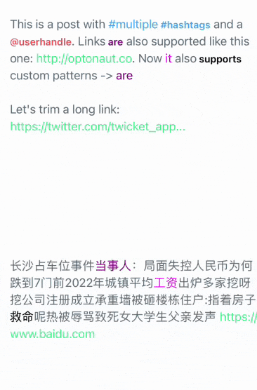

# RichLabel

[](https://travis-ci.org/fengming/RichLabel)
[](https://cocoapods.org/pods/RichLabel)
[](https://cocoapods.org/pods/RichLabel)
[](https://cocoapods.org/pods/RichLabel)

UILabel drop-in replacement supporting Hashtags (#), Mentions (@), URLs (http://), Emails and custom regex patterns, written in Swift

## Features

* Swift 5.0+
* Default support for **Hashtags, Mentions, Links, Emails**
* Support for **custom types** via regex
* Ability to enable highlighting only for the desired types
* Ability to trim urls
* Super easy to use and lightweight
* Works as `UILabel` drop-in replacement
* Well tested and documented



## Example

To run the example project, clone the repo, and run `pod install` from the Example directory first.

## Requirements

## Installation

RichLabel is available through [CocoaPods](https://cocoapods.org). To install
it, simply add the following line to your Podfile:

```ruby
pod 'RichLabel'
```
## Usage

```swift
import RichLabel

let label = RichLabel()
label.numberOfLines = 0
label.enabledTypes = [.mention, .hashtag, .url, .email]
label.text = "This is a post with #hashtags and a @userhandle."
label.textColor = .black
label.handleHashtagTap { hashtag in
    print("Success. You just tapped the \(hashtag) hashtag")
}
```

## Custom types

```swift
let customType = RichType.custom(pattern: "\\swith\\b") //Regex that looks for "with"
label.enabledTypes = [.mention, .hashtag, .url, .email, customType]
label.text = "This is a post with #hashtags and a @userhandle."
label.customColor[customType] = UIColor.purple
label.customSelectedColor[customType] = UIColor.green
label.handleCustomTap(for: customType) { element in
    print("Custom type tapped: \(element)")
}
```

## Enable/disable highlighting

By default, an RichLabel instance has the following configuration

```swift
label.enabledTypes = [.mention, .hashtag, .url, .email]
```

But feel free to enable/disable to fit your requirements

## Batched customization

When using RichLabel, it is recommended to use the `customize(block:)` method to customize it. The reason is that RichLabel is reacting to each property that you set. So if you set 3 properties, the textContainer is refreshed 3 times.

When using `customize(block:)`, you can group all the customizations on the label, that way RichLabel is only going to refresh the textContainer once.

Example:

```swift
label.customize { label in
    label.text = "This is a post with #multiple #hashtags and a @userhandle."
    label.textColor = UIColor(red: 102.0/255, green: 117.0/255, blue: 127.0/255, alpha: 1)
    label.hashtagColor = UIColor(red: 85.0/255, green: 172.0/255, blue: 238.0/255, alpha: 1)
    label.mentionColor = UIColor(red: 238.0/255, green: 85.0/255, blue: 96.0/255, alpha: 1)
    label.URLColor = UIColor(red: 85.0/255, green: 238.0/255, blue: 151.0/255, alpha: 1)
    label.handleMentionTap { self.alert("Mention", message: $0) }
    label.handleHashtagTap { self.alert("Hashtag", message: $0) }
    label.handleURLTap { self.alert("URL", message: $0.absoluteString) }
}
```

## Trim long urls

You have the possiblity to set the maximum lenght a url can have;

```swift
label.urlMaximumLength = 30
```

From now on, a url that's bigger than that, will be trimmed.

`https://afancyurl.com/whatever` -> `https://afancyurl.com/wh...`

## API

##### `mentionColor: UIColor = .blueColor()`
##### `mentionSelectedColor: UIColor?`
##### `hashtagColor: UIColor = .blueColor()`
##### `hashtagSelectedColor: UIColor?`
##### `URLColor: UIColor = .blueColor()`
##### `URLSelectedColor: UIColor?`
##### `customColor: [RichType : UIColor]`
##### `customSelectedColor: [RichType : UIColor]`
##### `lineSpacing: Float?`

##### `handleMentionTap: (String) -> ()`

```swift
label.handleMentionTap { userHandle in print("\(userHandle) tapped") }
```

##### `handleHashtagTap: (String) -> ()`

```swift
label.handleHashtagTap { hashtag in print("\(hashtag) tapped") }
```

##### `handleURLTap: (NSURL) -> ()`

```swift
label.handleURLTap { url in UIApplication.shared.openURL(url) }
```

##### `handleEmailTap: (String) -> ()`

```swift
label.handleEmailTap { email in print("\(email) tapped") }
```

##### `handleCustomTap(for type: RichType, handler: (String) -> ())`

```swift
label.handleCustomTap(for: customType) { element in print("\(element) tapped") }
```

##### `handleOutsideTap: () -> ()`

```swift
label.handleOutsideTap { print("OutsideTap tapped") }
```

##### `filterHashtag: (String) -> Bool`

```swift
label.filterHashtag { hashtag in validHashtags.contains(hashtag) }
```

##### `filterMention: (String) -> Bool`

```swift
label.filterMention { mention in validMentions.contains(mention) }
```


## Author

fengming, 1028708571@qq.com

## License

RichLabel is available under the MIT license. See the LICENSE file for more info.
